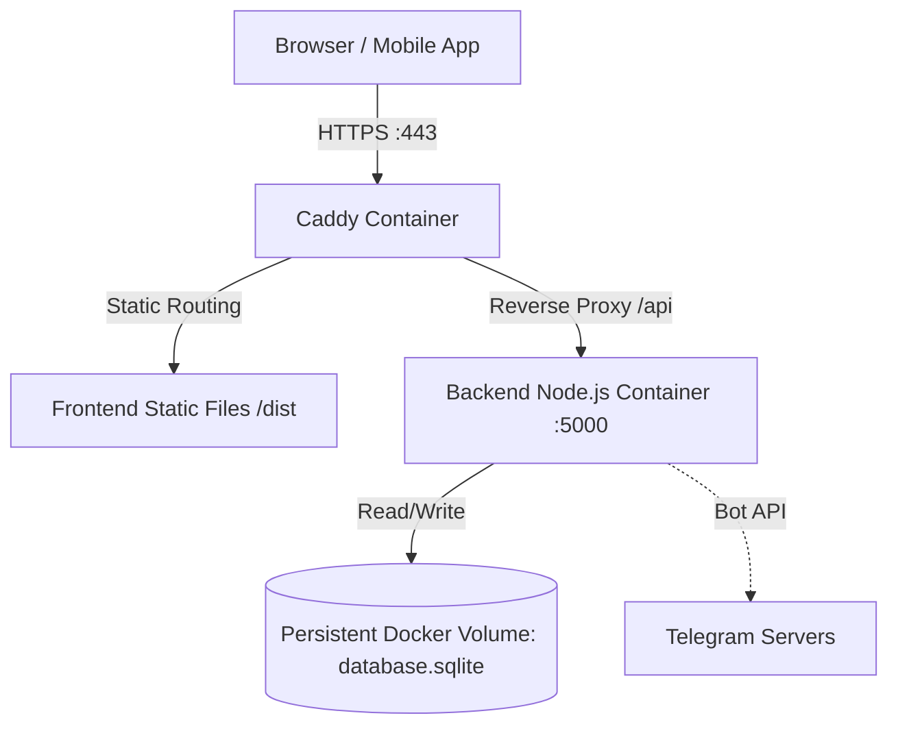

# Shiva Honda - Dealer Daily Reporting System

## 1. Project Overview
- **Project Name:** Shiva Honda Dealer Daily Reporting System
- **Purpose:** A centralized platform for tracking daily dealer stock, dispatches, retail sales, target completion, and stock adjustments for a Honda dealership network. 
- **Features:** 
  - Dealer and Network Manager authentication with OTP (2FA) and Telegram integration.
  - Mobile app for reporting daily retail sales and viewing live stock.
  - Admin Web Dashboard with real-time analytics, charts, and report generation (Excel/PDF).
  - Dispatch, Stock Adjustment, and Monthly Target management.
  - Automated Cron Reminders via Telegram.
  - Complete Activity Logging for audit trails.
- **Technologies Used:** React, React Native (Expo), Node.js, Express, SQLite, Docker, Caddy.

---

## 2. Tech Stack (Production)
Based on the production VPS deployment parameters:
- **React** (Admin Web Dashboard via Vite)
- **Node.js & Express** (Backend API Server)
- **SQLite** (Database)
- **Docker & Docker Compose** (Containerization and Orchestration)
- **Caddy** (Reverse Proxy & Automatic SSL)

**NOT used in this project:**
- Vue, Angular, MySQL, PostgreSQL, Nginx, PM2.

---

## 3. Production Directory Structure (`/opt/NewNetwork`)
On the VPS, the project resides at `/opt/NewNetwork` and relies on Docker volumes.

- **`/opt/NewNetwork/`**: Root project directory on the VPS.
  - `docker-compose.yml`: Orchestrates the backend, frontend (if containerized), and Caddy.
  - `Caddyfile`: Reverse proxy configuration for routing domain traffic and auto-SSL.
  - **`backend/`**: Node.js backend source code and `Dockerfile`.
  - **`admin-dashboard/`**: React frontend source code and `Dockerfile`.
  - **`database_volume/`** (or named volume): Persistent bind mount storing the live `database.sqlite` file outside of container lifecycles to prevent data loss.

---

## 4. Backend
- **Framework:** Node.js with Express.js.
- **API Routes:** Separated into modular routes under `routes/` (auth, dealer, report, master, etc.).
- **Controllers:** Business logic mapped to routes (e.g., `authController.js`).
- **Database:** SQLite database. In production, this file is stored in a Docker persistent volume.
- **Authentication:** JWT-based authentication combined with bcrypt and Telegram OTP 2FA.
- **Configuration:** Environment variables (`.env`) passed into the Docker container.

---

## 5. Frontend
- **Framework:** React 19 (via Vite).
- **Routing:** Handled internally by React state management (Sidebar navigation).
- **Pages:** Split into modular feature pages (Dashboard, Dealers, Reports, DealerStock).
- **Build:** Compiled into static files (`/dist`) within the Docker build process and served either by Caddy directly or an internal static server.

---

## 6. Database
- **Database Type:** SQLite.
- **Location in Production:** A persistent Docker volume mapped to the host (e.g., `/opt/NewNetwork/data/database.sqlite`).
- **Schema:** Managed natively via SQL commands stored in `backend/database/schema.sql`. Initializes dynamically on container startup if missing.

---

## 7. Environment Variables
Stored securely on the VPS (typically passed in `docker-compose.yml`):
- `PORT`: Exposed internal Docker port (usually 5000).
- `JWT_SECRET` & `JWT_REFRESH_SECRET`: Cryptographic keys for JWT signing.
- `TELEGRAM_BOT_TOKEN`: The API token obtained from BotFather for OTPs/alerts.
- `COMPANY_NAME`: Enterprise identifier (My Shiva Honda).
- `REMINDER_TIME_1` through `REMINDER_TIME_4`: Cron job trigger times.

---

## 8. Docker & Orchestration
- **Docker Compose:** Manages the multi-container setup (Backend Node.js container + Caddy reverse proxy container).
- **Dockerfile (Backend):** Installs Node modules and runs the Express server.
- **Dockerfile (Frontend):** Builds the Vite React app and outputs static files.
- **Volumes:** Crucial persistent volume mapping host `/opt/NewNetwork/data` to the container's database path to ensure `database.sqlite` survives container restarts.
- **Networks:** Internal Docker network securely connecting Caddy to the Backend without exposing port 5000 directly to the internet.

---

## 9. Safe Update Workflow (Frontend, Backend, Database)
When updating the production server at `/opt/NewNetwork`:

1. **Connect to VPS:** `ssh user@your-vps-ip`
2. **Navigate to Project:** `cd /opt/NewNetwork`
3. **Pull Changes:** `git pull origin main` (or via FileZilla upload).
4. **Rebuild Containers:** 
   ```bash
   docker compose up -d --build
   ```
   *Note: This safely rebuilds the Node.js and React containers with the new code while leaving the persistent database volume completely untouched.*

---

## 10. Deployment Checklist
**Before Update:**
- [ ] Verify no critical operations are ongoing.
- [ ] Backup the persistent SQLite volume (see Backup Strategy).

**After Update:**
- [ ] Run `docker compose ps` to ensure containers are `Up`.
- [ ] Check logs: `docker compose logs -f backend` to verify successful DB connection.
- [ ] Verify the Admin Dashboard loads and data is intact.

---

## 11. Production Requirements
- **Domains & SSL:** Caddy automatically provisions and renews SSL certificates from Let's Encrypt for your domain.
- **Reverse Proxy:** Caddy proxies requests from HTTPS `443` to the internal Docker network backend container.
- **Ports:** Only `80` (HTTP for SSL validation) and `443` (HTTPS) should be exposed to the internet. Port `5000` remains internal to the Docker network.

---

## 12. Backup & Restore Strategy
- **Backup Procedure:** 
  Since the database is a single SQLite file on a persistent volume, backup is straightforward:
  ```bash
  cp /opt/NewNetwork/data/database.sqlite /opt/NewNetwork/backups/db_backup_$(date +%F).sqlite
  ```
- **Restore Procedure:**
  1. Stop containers: `docker compose down`
  2. Replace the active DB with backup: `cp /opt/NewNetwork/backups/db_backup_XYZ.sqlite /opt/NewNetwork/data/database.sqlite`
  3. Restart containers: `docker compose up -d`

---

## 13. FileZilla Updates
- **Which files can be updated via FileZilla:** Source code files (`.js`, `.jsx`, `.css`). 
- **Required Action After FileZilla Update:** Because Docker containerizes the application, simply modifying the source code on the VPS host using FileZilla will **NOT** immediately update the running app. You **MUST** run `docker compose up -d --build` in the terminal for Docker to copy the new files and compile them into a new container.

---

## 14. Architecture Diagram


---

## Final Production Answers:

1. **Is this project Docker-based?** Yes, production runs entirely on Docker.
2. **Does it require Docker rebuild after code changes?** Yes. Any code change (uploaded via Git or FileZilla) requires `docker compose up -d --build`.
3. **Does frontend require build?** Yes, the Vite build is handled automatically within the Dockerfile process during rebuilds.
4. **Does backend require restart?** Yes, the backend container restarts automatically when rebuilt via docker compose.
5. **Is PM2 used?** No. Docker Compose handles process management and automatic restarts.
6. **Is Caddy used?** Yes. It acts as the web server, reverse proxy, and automatic SSL provider.
7. **Is Nginx used?** No. Caddy replaces Nginx.
8. **Where is the database stored?** Inside a persistent Docker bind mount/volume mapped to the host (e.g., `/opt/NewNetwork/data/database.sqlite`).
9. **Is the database persistent?** Yes, the volume ensures data survives container teardowns.
10. **Which folders should never be overwritten during deployment?** The directory containing the persistent database volume (e.g., `/opt/NewNetwork/data`).
11. **Which files can safely be updated through FileZilla?** Source code files, but you must still run `docker compose up -d --build` via SSH afterward for the changes to apply.
12. **What is the recommended production deployment workflow?** `git pull` -> `docker compose up -d --build` -> verify logs.
